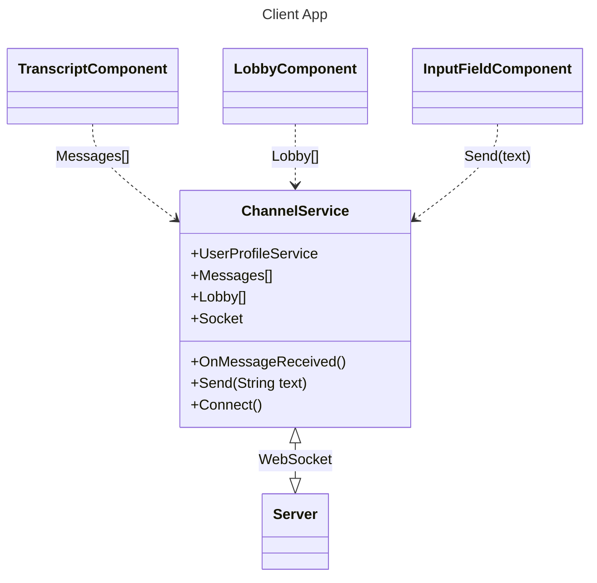
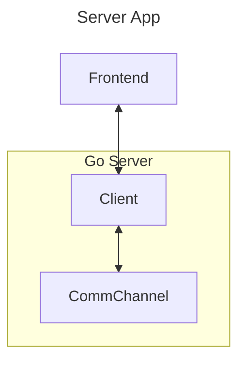

# Boredomboard

## How it works

* [channel.service.ts](../projects/app-client/src/app/channel.service.ts)
  * An injectable service that implements the core functionality of the client application, this service is responsible for the interaction with the server app and it represents the chat state on the client side. See [Dependency Injection](awef)

* [Message.go](../projects/boredomboard/internal/server/Message.go)
  * The client and server communicates through WebSockets.
  This represents how messages are structed on the server side. The client app needs to structure it's messages to the schema defined by the server.

  * The WebSocket messages are in JSON, the client app needs to use the appropriate keys defined in the struct tags.

* [CommChannel.go](../projects/boredomboard/internal/server/CommChannel.go)
  * Within the server, CommChannel represents the true state of the chat, it's responsible for relaying messages to connected peers, keeping track of the transcript, and connected clients.

* [Client.go](../projects/boredomboard/internal/server/Client.go)
  * Represents the client connection on the server side.

